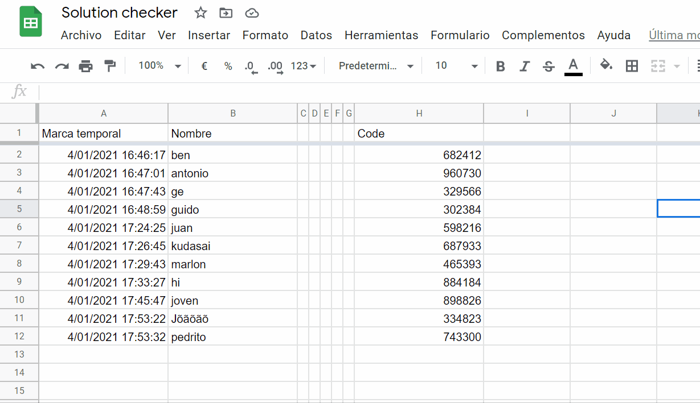

# Google Sheets FMC Solution Checker
A Google Sheets document that can verify FMC solutions using an external REST API.

Also, a bonus ID generator for online unofficial [speedcubing](https://www.worldcubeassociation.org/) competitions.

Example usages:




---

# But... how??

Did you know Google Sheets has *so* much more functionality than you thought?  
As in: you can actually write your own functions and use them on the sheet. Like, really anything you want.

Check out this feature on the `Tools > Script Editor` menu.

In this case, I wrote the functions on the `code.gs` file: `checkSolutions()` and `genCode()`.

### checkSolutions

For each row with a scramble and no result, it sends a GET request to my REST API using the values on the specified column, which are the solutions some people could have submitted using a form or something, and a fixed scramble. In this example, it uses a form.

> *Note: the API only supports notation that is valid for the WCA FMC event, except the useless "2Fw" type of moves which should be removed from the regulations as soon as possible. You can learn more about it [here](https://www.worldcubeassociation.org/regulations/#12a).*

The API then returns an integer which will be the length of the solution in case it was correct and less or equal to `80`, or `DNF` (string) otherwise.  
These values are afterwards written down on the sheet on the specified column.

As it is now, the function is triggered every time the form associated to the Sheet is sent, but you can set other triggers such as: on Sheet reload, on X amount of time, etc., by going to the Script Trigger tab on the Edit menu within the Script Editor.

### genCode

On these online comps, users identify themselves with a unique ID that they get when they sign up.  
This is also retrieved from the API. Why not use `RANDBETWEEN`? Because we don't want to. We're super cool.

# Can I use this?

Sure, I don't mind at all. I did this for Marlon de V. Marques on a lazy Sunday, to help with the _Silêncio em Casa_ online comp saga.  

If you want to recreate this, you just have to create a `.gs` file on your Google Sheet, set it up like mine, and just paste my code in there.  
Or you could change the queries within the Sheet. Do whatever you want.

Otherwise, if you just want the API, consume it like this:

```
https://solution-checker.guidodipietro.repl.co/<scramble>/<solution> -> checks solution
https://solution-checker.guidodipietro.repl.co/code -> generates an int between 100 000 and 999 999
```

or check the live REPL.IT [here](https://repl.it/@GuidoDipietro/solution-checker).

# Thanks

No poblers
